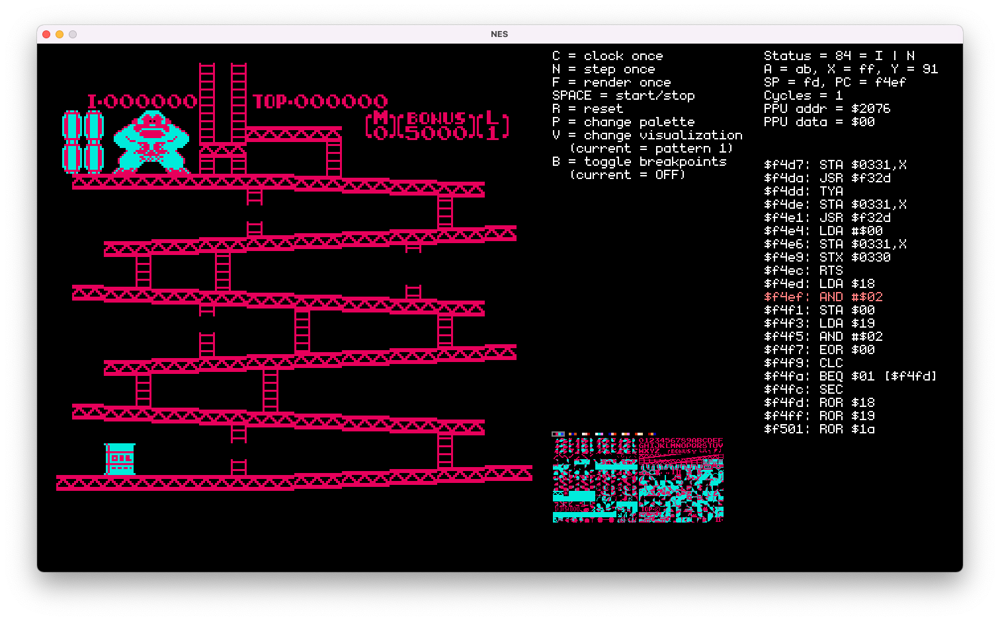

# NES Emulator

A (WIP) fully-functioning NES emulator. Works as a standalone application or in 
the browser using [emscripten](https://emscripten.org/).

## Features

- [x] Fully functional 6502 emulator
- [x] .nes ROM file loading and address mapping
- [ ] In progress: PPU rendering
- [ ] APU and sound

## Screenshots

